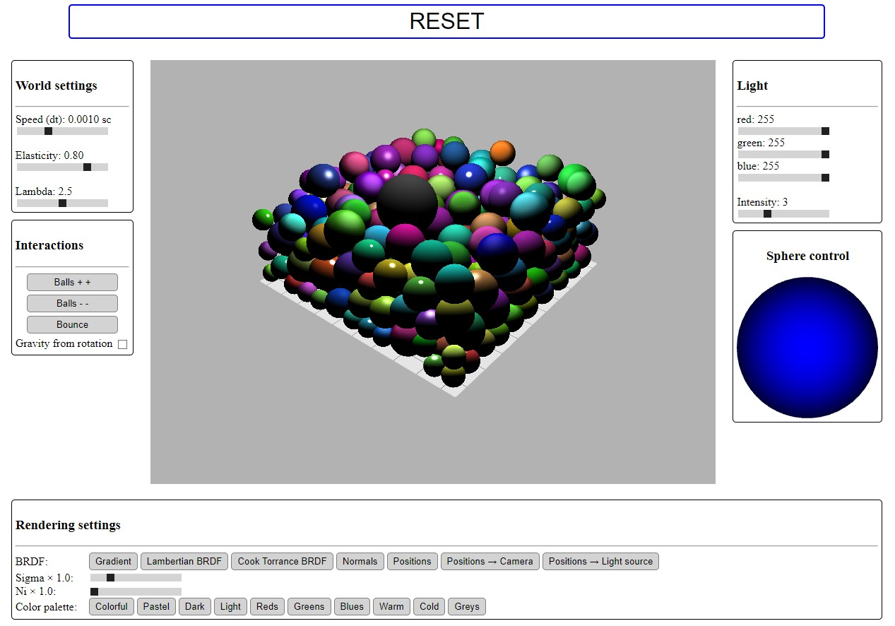

# Project files tree

```
│   callbacks.js
│   glCourseBasis.js
│   main.html
│   readme.md
│   style.css
│
├───balls
│       AppBalls3D.js: Manages buffers and shaders for the balls. Initialize the
|                      Box3D instance.
│       Ball3D.js    : Contains two classes. One for the main ball controled by
|                      the player. A second one for all other balls.
│       Box3D.js     : Class for the 3D box, containing simulation parameters
|                      and the list of created balls.
│
├───shaders
│       balls.frag/.vert       : shaders for the balls (with BRDF)
│       joystick.frag/.vert    : shaders for the joystick (a blue circle)
│       laser.frag/.vert       : shaders for the lasers (white lines)
│       light-source.frag/.vert: shaders for the light source
│       plane.frag/.vert       : shaders for the floor plane
│
├───user
│       Camera.js     : Class for the camera (position, orientation, control)
│       Joystick2D.js : Manages the virtual joystick (shaders, input, etc.)
│       Laser.js      : Methods to render a laser (white line)
│       LightSource.js: Manages light source
│
└───utils
        ColorGenerator.js: Static class for color generation
        glMatrix.js      : Usual methods on vectors and matrix
        Matrix.js        : Usual methods on matrix
        Vector.js        : Usual methods on vectors
```

# Controls

## Ball's control

The main ball can be controlled by the user and is not subject to gravity nor air friction, and is not pushed back by collisions with other balls.

Its position can be changed with the keyboard:
- `Z`: forward
- `S`: backward
- `Q`: left
- `D`: right
- `Arrow up`: up
- `Arrow down`: down

Or with the virtual joystick:
- Maintaining mouse down on the joystick change the speed of the ball in according direction, and therefore its position
- Scrolling with mouse over the joystick will make the ball move up and down

## Light source's control

The light source is displayed as a disk and can be moved in the camera plane by pressing `Ctrl` + left mouse click. Its color and intensity can be changed with dedicated slider inputs.

## Laser

Pressing `X` key shoot a laser from the camera to the center of the plane. Each ball intersected by the white line is split in two. If the radius of the ball ends up too small, then it is removed.

## World settings

- `Speed (dt)`: slow down or speed up the simulation
- `Elasticity`: box wall's elasticity, varying between 0 (nill the balls speed when they collide in the walls) to 1 (no decceleration when balls bounce against the walls)
- `Lambda`: air friction coefficient, varying between 0 (no friction, void) to 5 (very thick air)
- `Gravity direction` can be either the floor plan (default) or depending on the camera direction

## Rendering settings

- `BRDF` definition from:
  - circular gradient with no respect to light
  - lambertian BRDF
  - Cook Torrance BRDF
  - Normals (with mapping XYZ to RGB)
  - Positions (with mapping XYZ to RGB)
  - Normalized direction from position to camera (with mapping XYZ to RGB)
  - Normalized direction from position to light source (with mapping XYZ to RGB)
- `sigma` and `ni`: used in Cook-Torrance BRDF
- Color palette for a set of different choices

## Set of balls
  - `Balls++` and `Balls--`: add or remove several balls to the simulation.
  - `Bounce`: make all the balls which are touching the floor bounce (except the player's one)